# Hotel Manager - NMCNPM - UIT

🏩 Đồ án quản lý khách sạn C# 💖

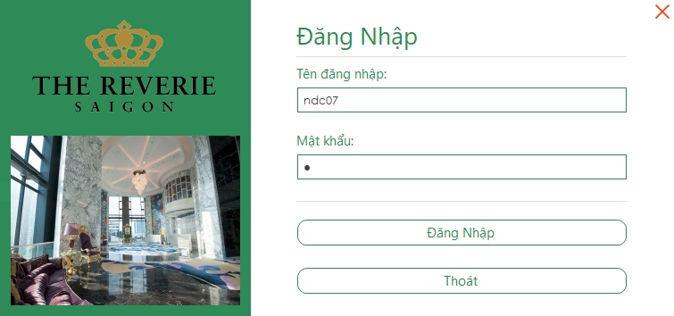

## Features
* Đặt phòng
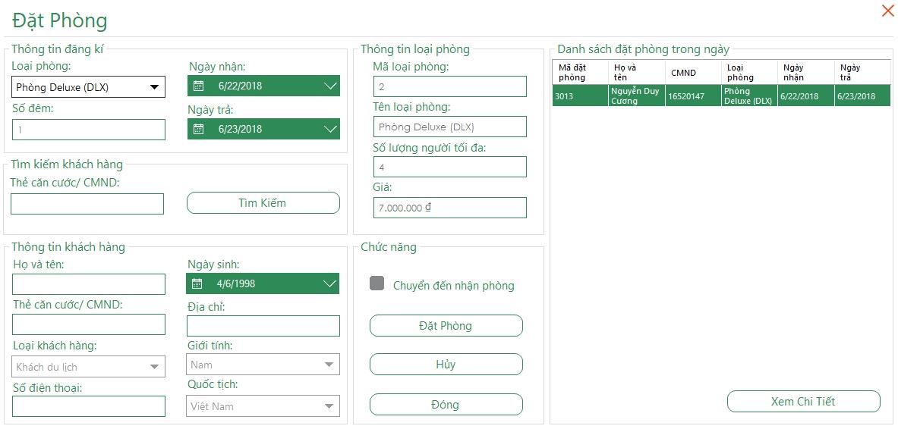
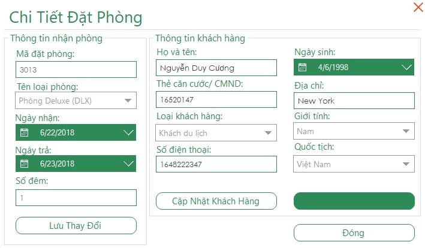
* Nhận phòng
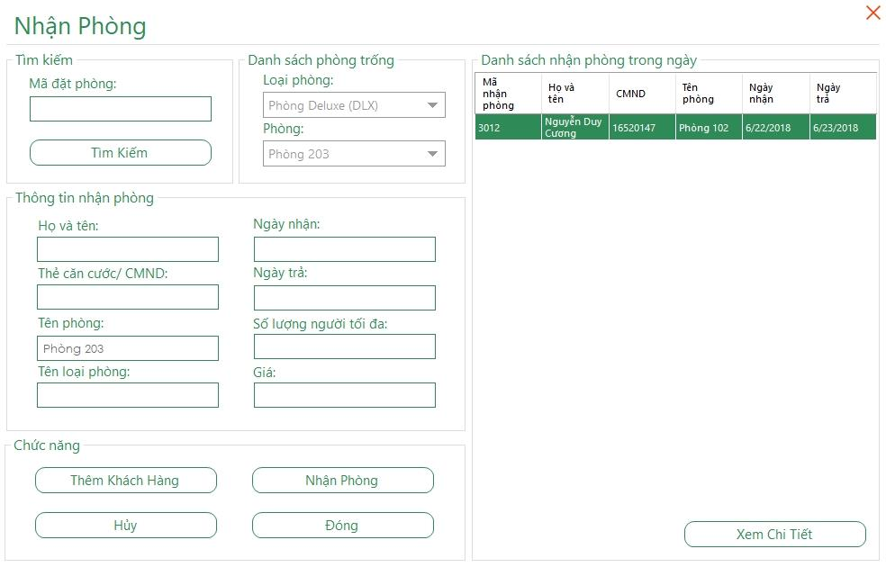

* Đổi phòng

* Sử dụng dịch vụ và thanh toán
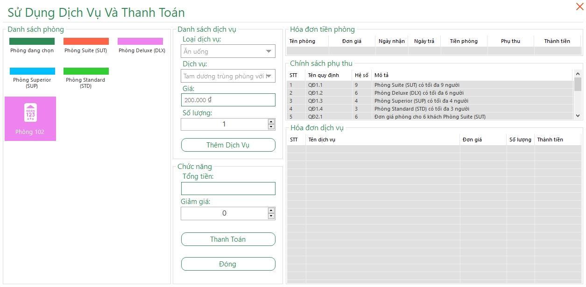
* Cập nhật thông tin khách hàng

* Quản lý khách hàng
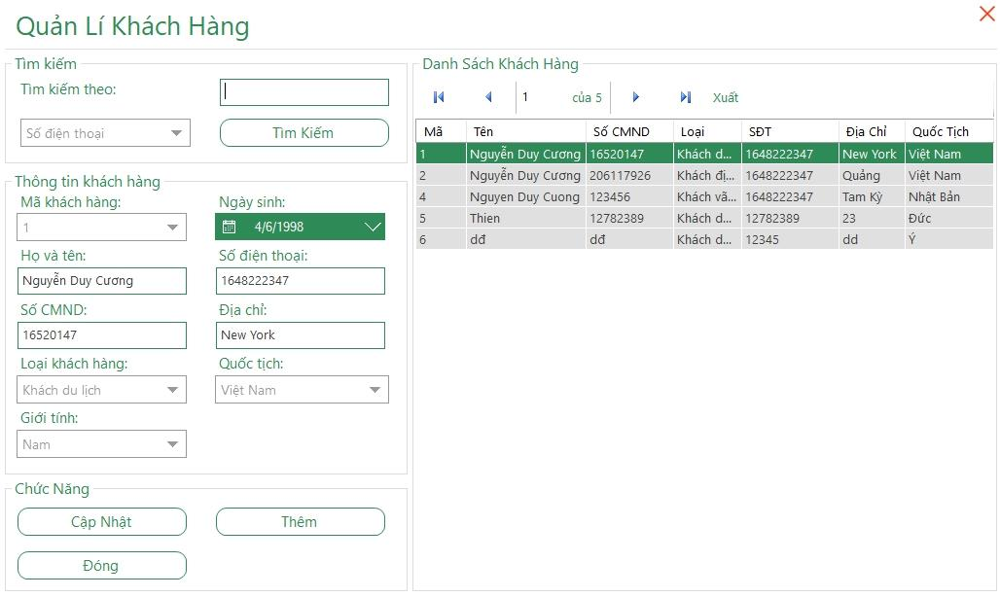
* Quản lý dịch 
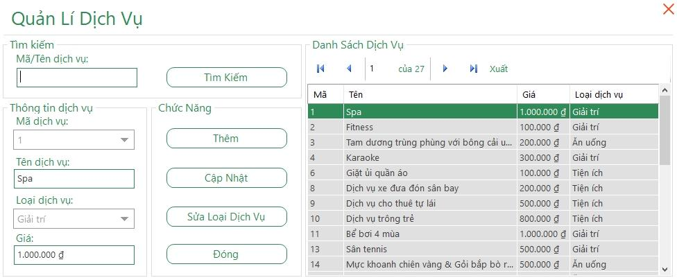
* In hóa đơn
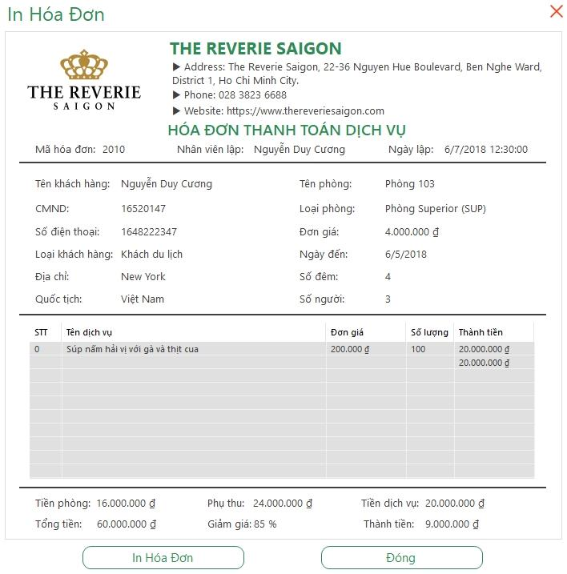
* Quản phòng và loại phòng

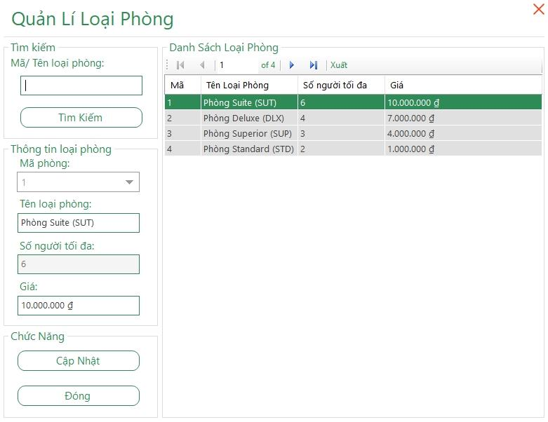
* Quản lý nhân viên

* Phân quyền
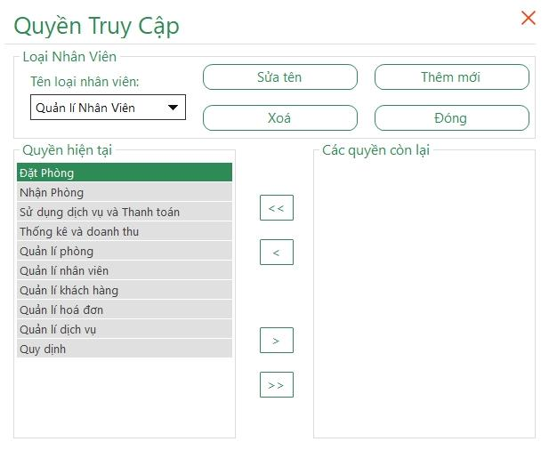
* Báo cáo doanh thu theo từng loại phòng

* Thay đổi quy định
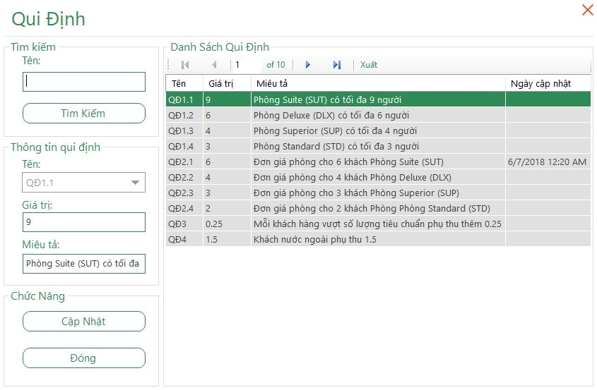
* Thay đổi thông tin ca nhân
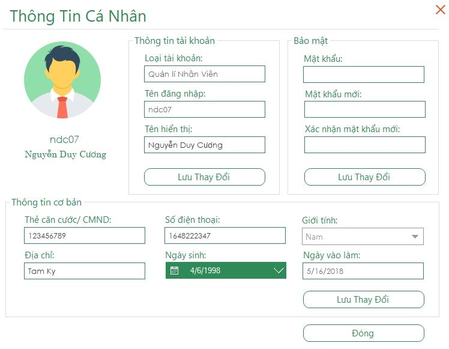

## Deployment
* .NET Framework 4.6.1
* SQL Server 2017
## Authors

* **Vi Chi Thien** - [tvc12](https://github.com/tvc12) 🐶
* **Nguyen Duy Cuong** - [ndc07](https://github.com/ndc07) 💎
* **Le Huu Thang** - [lhthang1998](https://github.com/lhthang1998) 🐷
* **Tran Minh Triet** - [triet1213](https://github.com/triet1213) 🐶

## License

[MIT](https://github.com/tvc12/HotelManager/blob/master/LICENSE)
